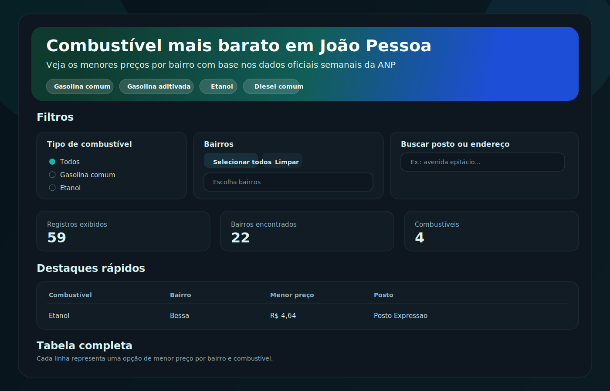

# Gasolina JP

App em Python para mostrar os combustíveis mais baratos em João Pessoa, usando dados abertos da ANP.

## Visualização

Arquitetura:
- `src/gasolina_jp/pipeline.py`: concentra a regra de negócio (download ANP, leitura da planilha, filtro João Pessoa e top 3).
- `scripts/update_data.py`: executa o pipeline e salva os arquivos.
- `app.py`: interface Streamlit.

Stack:
- requests para baixar a planilha semanal oficial da ANP
- pandas para ler Excel, limpar, filtrar e ordenar
- streamlit para a interface web
- openpyxl como engine de leitura do XLSX oficial

## Escopo

- Combustíveis: gasolina comum, gasolina aditivada, etanol e diesel comum.
- Cidade: João Pessoa/PB.
- Ranking: até 3 menores preços por bairro e combustível.
- Atualização: semanal (GitHub Actions).

## Requisitos

- Python 3.11+

## Dados da ANP

O projeto usa por padrão a página oficial da ANP com as semanas mais recentes:
- https://www.gov.br/anp/pt-br/assuntos/precos-e-defesa-da-concorrencia/precos/levantamento-de-precos-de-combustiveis-ultimas-semanas-pesquisadas

A aplicação encontra automaticamente o primeiro link de planilha `revendas_lpc*.xlsx` dessa página e baixa o arquivo semanal oficial.

O arquivo bruto semanal fica salvo em `data/raw/anp_latest_raw.xlsx`.

## Atualização semanal

Workflow em `.github/workflows/weekly_update.yml`:
- Roda toda segunda-feira.
- Atualiza `data/raw/anp_latest_raw.xlsx` e `data/processed/joao_pessoa_combustiveis.csv`.
- Faz commit automático quando houver mudança.
